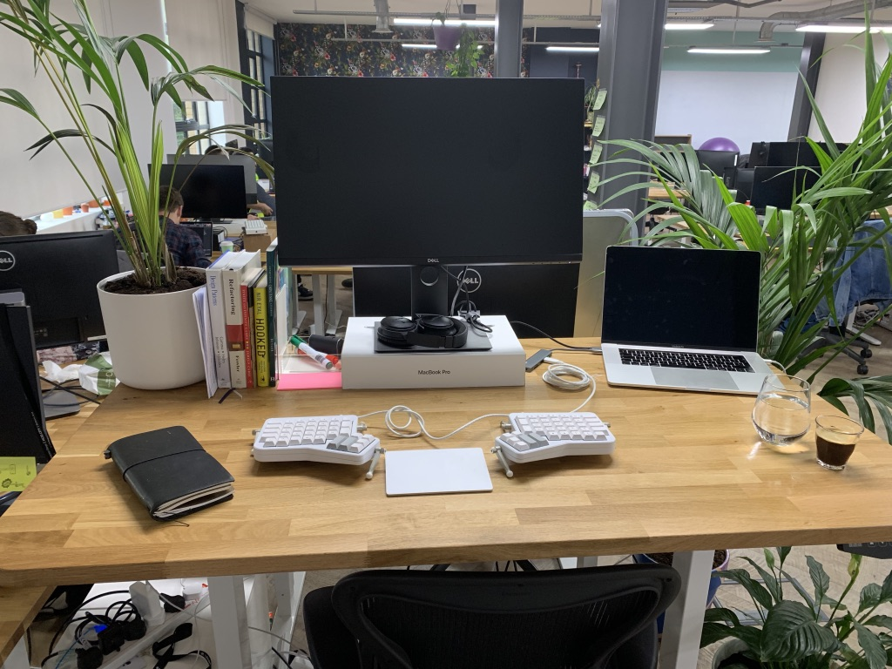
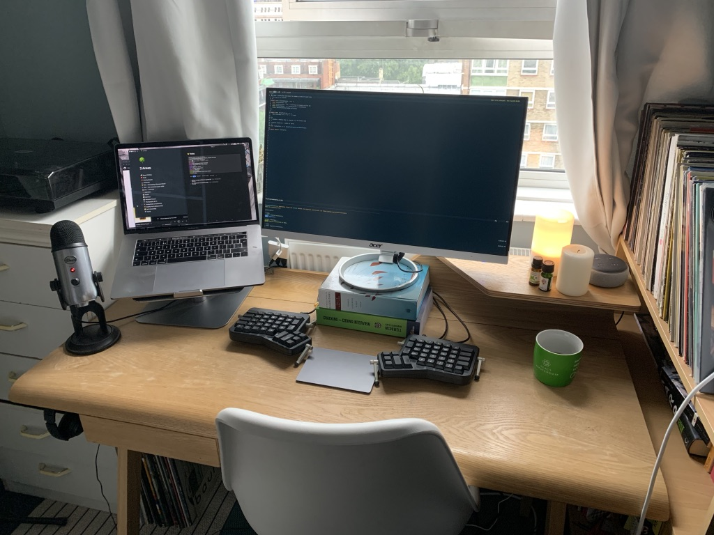

Towards the end of last year, I decided to implement an improved
linting setup on a large codebase. Although our code quality is now
much improved, my wrists had to suffer through manually fixing ~3000
errors. For weeks, my productivity was slashed as I got dangerously
close to having to stop coding completely because of the pain.

Fortunately, through a lot of experimentation, I’ve almost completely
fixed my wrist issues. I wanted to summarise what did and didn’t work
and share some tips with other developers to save them having to go
through the same thing.

## Successful Strategies for Reducing Wrist Pain

### Buying a New Keyboard (and Free Alternatives)

The biggest thing I could recommend is getting a new, ergonomic
keyboard. It turns out the term ‘ergonomic’, much like ‘organic’,
doesn’t really mean anything, so you might have to do some
experimentation to find something that fits your body well. For me,
that meant switching to the ErgoDox (EZ) _/link and image/_. People
also seem to like
[Microsoft](https://www.googleadservices.com/pagead/aclk?sa=L&ai=DChcSEwi4tIH8j5zkAhVFtO0KHbLUD7oYABABGgJkZw&ohost=www.google.com&cid=CAESQOD2llcH5qEVUm86rdsoXED_ZcmYKOvPbJsSEwOYdcuX_MSCO8RapixHCjVZahCNMBX1aqT2BDub-a_9um46elg&sig=AOD64_12SmhdIxvrTv6b15ZLKGL52JFXSw&ctype=5&q=&ved=0ahUKEwi88fn7j5zkAhULUxUIHYE1D-0Q9aACCDw&adurl=)
and [Kinesis’s](https://kinesis-ergo.com/shop/advantage2/)
alternatives.

Although the way it fits my hands is a vast improvement over a laptop
keyboard, the real advantage of the ErgoDox is being able to
completely reorganise your keys. Because the layout is so weird and
there are so many modifiers and layers available, you can fully design
an ergonomics-first layout. The things that helped me most were moving
my most used keys onto the home row and away from problematic little
fingers that were previously having to strain (I love JavaScript’s use
of back-ticks, but hate their standard positioning on the keyboard),
creating a symbol layer that reduced the the usage of the Shift key
and moving Shift and Control directly under my fingers, rather than
out to the side. You can check out my layout
[here](https://configure.ergodox-ez.com/ergodox-ez/layouts/40RQM/latest/2).

If you can’t afford to buy a keyboard for yourself (or if you can!),
ask your employer if they can help you out. I was surprised when I
spoke to other developers and they were ashamed to ask for something
which cost less than 1% of their salary yet could dramatically
increase their productivity. When you factor in that a new keyboard
will probably also help you type a great deal faster, its a no-brainer
for your employer to cover the expense.

If you have an irrational employer, are self-employed, or are
otherwise unable to afford a keyboard, you can still hack together a
new ergonomic layout. Mapping my ErgoDox made me wonder what other
improvements could be made to my standard laptop keyboard for when I
was travelling or working from coffeeshops.

One common trick I see is to remap the Caps Locks key to Control so
that you don’t have to strain to the bottom left. You can do this via
Settings \> Keyboard \> Modifier keys on a Mac.

If you want to do a more complete remapping like me, I also found a
great, free bit of software called
[Karabiner Elements](https://pqrs.org/osx/karabiner/). This app has
allowed me to add a second Control on the right of my keyboard, move
my shift keys to a more comfortable position, and convert that weird
‘§‘ symbol to a vim-friendly, mechanical Escape key on my Touch Bar
Mac.

### Desk & Keyboard Positioning

Your desk is almost certainly too high. I’m 6’4” and 80% of desks I
use are too high for me. If you hold your elbows at a right-angle,
your keyboard needs to be just _below_ your hands in order to keep
your wrists straight. You want to aim to hover, not rest at an
awkward, upwards angle.

The second thing you want to watch out for in typing position is a
wrist-breaking upwards slope. I don’t know why exactly this is
(perhaps it’s inherited from mechanical typewriters needing their keys
in the correct place), but most keyboards slope upwards, causing your
wrists to bend as you type. I found it far more comfortable to tilt my
keyboard _downwards_ and outwards slightly so that the two halves now
somewhat resemble the outside of a large sphere that I can rest my
hands upon comfortably.

### Typing Properly

Finally, you need to learn to type properly. Even though I could
touch-type proficiently before I got RSI, I was still making a couple
of painful mistakes.

The main mistake was chording. Chording is where you use one hand to
type two distant keys. Press Shift-T on your keyboard with only your
left hand and you’ll see what I’m talking about.

The solution to this is using opposing hands properly. When you press
a letter with one hand, make sure you use the other hand to press the
shift key. This gets rid of painful stretching (and should speed up
your typing as an added bonus).

There are other minor bad typing habits that I picked up which I
solved in an effort to lessen RSI. Using the wrong fingers on X, C,
and B, only typing with one or two fingers on each hand and typing
harder than I needed all caused me unnecessary discomfort. Honestly,
the orthogonal layout of the ErgoDox was the best way to correct these
behaviours, but you could also film yourself typing or go carefully
through an online touch typing tool to make sure you’re using the
correct keys at all times.

## Failed Attempts

Throughout my experimentation, I tried several other strategies that
seemed to be ubiquitously recommended across the internet yet were
useless pieces advice for me personally.

Obviously, take a break where possible. However, your job most likely
involves a lot of typing and being told to stop typing might seem
analogous to being told to stop eating. So while I did try to type a
little less, this advice was more irritating than it was useful.

I also read a lot of advice that told me to stop using my mouse. This
didn’t really make much sense to me as I could clearly feel my wrists
hurting more when typing than when using my mouse.

Above all, you should know that this is a solvable issue and not
something to fret about. Take it easy for a week or two, try out some
of the solutions in this article, and you’ll be seeing improvements in
no-time.

---

Go any other tips? [Tweet me](https://twitter.com/mulholio),
[email me](mailto:james@jmulholland.com) me and or
[join the discussion on Hacker News](https://news.ycombinator.com/item?id=20847822).
